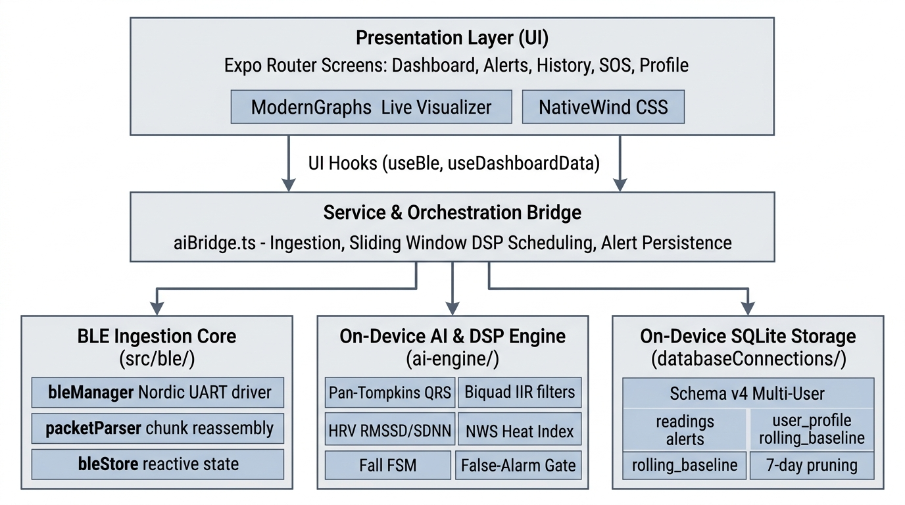

# Sanjeevni Mobile Application

The Sanjeevni mobile application is an offline-first wearable telemetry and on-device health companion built with React Native and Expo (SDK 57). It connects to the ESP32 Wearable Sensor Hub over Bluetooth Low Energy (BLE) using the Nordic UART Service (NUS) to perform continuous biopotential signal processing, environmental safety analysis, motion tracking, and automated emergency alerting without requiring internet, cellular data, or cloud servers.

---

## Architecture Overview

The mobile application is structured into four decoupled layers:



---

## Directory Structure

```text
mobile-app/
├── ai-engine/                          # Zero-dependency biomedical DSP & risk engine
│   ├── baseline/                       # Welford's running baseline & cold-start logic
│   ├── buffers/                        # Ring buffer for sliding-window calculations
│   ├── decision/                       # False-alarm hysteresis & risk decision engine
│   ├── ecg/                            # Biquad IIR filters, Pan-Tompkins, HR & HRV
│   ├── environment/                    # NWS Rothfusz heat index & AQI classifier
│   ├── fusion/                         # Multi-modal cross-sensor risk fusion
│   ├── mock/                           # Synthetic wave generator for simulator mode
│   ├── motion/                         # Activity state & fall detection state machine
│   ├── __tests__/                      # 7-test AI pipeline verification suite
│   ├── index.ts                        # processSensorTick() orchestrator
│   ├── package.json                    # Isolated package definition
│   └── README.md                       # In-depth DSP mathematical specification
├── databaseConnections/                # Local SQLite persistence engine
│   ├── database.ts                     # Schema v4 table definitions, CRUD & pruning
│   ├── database.web.ts                 # Safe in-memory mock fallback for web
│   ├── __tests__/                      # 12-test SQLite schema verification suite
│   └── README.md                       # Table schemas, indices & retention policy
├── src/                                # Mobile application source code
│   ├── app/                            # Expo Router file-based navigation
│   │   ├── (auth)/                     # Sign-in and sign-up views (Clerk auth)
│   │   ├── (tabs)/                     # Main bottom-tab views:
│   │   │   ├── index.tsx               # Dashboard (Live ECG, vitals sparklines, status)
│   │   │   ├── alerts.tsx              # Safety alerts log with acknowledgment
│   │   │   ├── history.tsx             # Historical telemetry trends & export
│   │   │   ├── sos.tsx                 # Emergency SOS trigger & contact calling
│   │   │   └── profile.tsx             # Medical profile, blood group & baselines
│   │   ├── _layout.tsx                 # Root layout, theme provider, DB initialization
│   │   ├── connect-device.tsx          # BLE device discovery & pairing modal
│   │   ├── onboarding.tsx              # First-launch feature walkthrough
│   │   └── onboarding-health.tsx       # Initial medical baseline setup
│   ├── ble/                            # Self-contained Bluetooth Low Energy module
│   │   ├── bleManager.ts               # Nordic UART Service GATT driver & auto-reconnect
│   │   ├── packetParser.ts             # Stream reassembly buffer & Base64/JSON parser
│   │   ├── bleStore.ts                 # Reactive telemetry store
│   │   ├── types.ts                    # Sensor contracts (Sensors 1-5)
│   │   ├── hooks/useBleConnection.ts   # Presentational hook for UI connection screens
│   │   └── README.md                   # BLE integration documentation
│   ├── components/                     # Modular UI components (charts, cards, banners)
│   ├── constants/                      # Image registries and theme constants
│   ├── data/                           # Mock datasets and metric details
│   ├── database/                       # Local SQLite persistence engine
│   │   ├── index.ts                    # Public API wrapper & safe multi-user queries
│   │   ├── database.ts                 # Schema v4 table definitions, CRUD & pruning
│   │   ├── database.web.ts             # Safe in-memory mock fallback for web
│   │   ├── vitalsHistory.ts            # Time-series vitals history aggregation service
│   │   ├── __tests__/                  # 12-test SQLite schema verification suite
│   │   └── README.md                   # Table schemas, indices & retention policy
│   ├── hooks/                          # Custom React hooks (useDashboardData, etc.)
│   ├── services/                       # aiBridge.ts (BLE -> AI Engine -> SQLite)
│   ├── store/                          # User profile and UI state stores
│   └── types/                          # Shared UI and dashboard types
├── __tests__/                          # Full end-to-end integration test
├── assets/                             # Fonts (Poppins) and app icons
├── plugins/                            # Custom Expo config plugins (ABI optimizations)
├── app.json                            # Expo manifest, Android permissions & plugins
├── eas.json                            # EAS build configuration (arm64-v8a target)
├── package.json                        # Mobile dependencies and npm scripts
├── tailwind.config.js                  # NativeWind Tailwind configuration
└── tsconfig.json                       # TypeScript compiler configuration with @/* aliases
```

---

## Execution Modes

The app supports two execution modes depending on runtime environment:

### 1. Expo Go (Simulation Mode)
- **Use Case**: Fast UI and application state development without needing a physical ESP32.
- **Behavior**: Because native C++/JNI Bluetooth drivers (`react-native-ble-plx`) cannot run inside the pre-compiled Expo Go client, the application automatically engages `syntheticDataGenerator.ts`.
- **Telemetry**: Generates mathematically realistic ECG waveforms (P-Q-R-S-T complexes at 500 Hz), dynamic 3-axis accelerometer tilts, and fluctuating ambient temperature/humidity cycles.

### 2. Standalone APK / Development Build (Hardware Mode)
- **Use Case**: Testing with the physical ESP32 Wearable Sensor Hub.
- **Behavior**: Initializes the full native Android BLE Central stack, requests necessary runtime permissions (`BLUETOOTH_SCAN`, `BLUETOOTH_CONNECT`, `ACCESS_FINE_LOCATION`), discovers `ESP32_SENSOR_HUB_BLE`, negotiates MTU 517, and ingests live sensor packets.

---

## Getting Started

### Prerequisites
- **Node.js**: v18.x or v20.x LTS
- **npm**: v9.x or higher
- **Expo CLI**: bundled via `npx expo`

### 1. Installation
Navigate to the `mobile-app` directory and install dependencies:
```bash
cd mobile-app
npm install --legacy-peer-deps
```

### 2. Environment Configuration
Copy the sample environment file:
```bash
cp .env.example .env
```
Edit `.env` if you need to configure authentication keys (a default offline bypass key is pre-filled).

### 3. Run in Development
Start the Expo bundler:
```bash
npm start
```
- Press **`a`** to open in an Android emulator.
- Scan the terminal QR code with **Expo Go** on an Android phone to run in Simulation Mode.

---

## Compiling Standalone Android APK

Because physical BLE communication requires native Android binaries, compile a standalone `.apk` for hardware testing:

### Option A: Cloud Build via EAS (Recommended)
```bash
# 1. Install EAS CLI
npm install -g eas-cli

# 2. Login to Expo
npx eas login

# 3. Build standalone preview APK
npx eas build -p android --profile preview
```

> **Build Optimization:** `eas.json` and `plugins/withReactNativeArchitectures.js` are configured to compile exclusively for `arm64-v8a`. This avoids building redundant 32-bit and emulator ABIs, reducing cloud compile times to ~6–8 minutes.

### Option B: Local Android Build
```bash
# 1. Generate native android project
npx expo prebuild --platform android

# 2. Compile release APK with Gradle
cd android
./gradlew assembleRelease -PreactNativeArchitectures=arm64-v8a
```
Output APK is located at: `android/app/build/outputs/apk/release/app-release.apk`.

---

## Testing & Verification

All test suites can be executed directly:

```bash
# 1. AI Biomedical DSP Test (7 tests):
npx tsx ai-engine/__tests__/aiPipeline.test.ts

# 2. SQLite Database & Schema Test (12 tests):
npx tsx databaseConnections/__tests__/databaseSchema.test.ts
npx tsx src/database/__tests__/databaseSchema.test.ts

# 3. Full End-to-End System Integration Test:
npx tsx __tests__/endToEndIntegration.test.ts

# 4. TypeScript Typecheck:
npm run typecheck
```

Or execute all tests in sequence:
```bash
npm test
```
